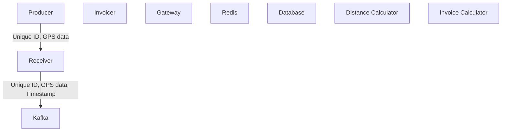

# Vehile Tracking Overview

Reference: [fulltimegodev](https://fulltimegodev.teachable.com/courses/full-time-go-dev/lectures/46721996) by Anthony GG

```mermaid
flowchart TB
    A1["Producer"]
    A2["Receiver"]
    A3["Invoicer"]
    A4["Gateway"]

    B1["Kafka"]
    B2["Redis"]
    B3["Database"]

    C1["Distance Calculator"]
    C2["Invoice Calculator"]

    A1 -- "Unique ID, GPS data" --> A2
    A2 -- "Unique ID, GPS data, Timestamp" --> B1
    
```
